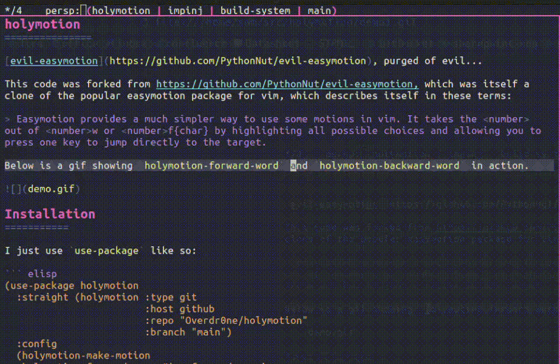

holymotion
===============

[evil-easymotion](https://github.com/PythonNut/evil-easymotion), purged of evil...

In order to remove the dependency on evil, this code was forked from https://github.com/PythonNut/evil-easymotion, which was itself a clone of the popular easymotion package for vim, which describes itself in these terms:

> Easymotion provides a much simpler way to use some motions in vim. It takes the <number> out of <number>w or <number>f{char} by highlighting all possible choices and allowing you to press one key to jump directly to the target.

Below is a gif showing holymotion versions of forward/backward-word and next/previous-line.



Installation
===========

I just use `use-package` like so:

``` elisp
(use-package holymotion
  :straight (holymotion :type git
                        :host github
                        :repo "Overdr0ne/holymotion"
                        :branch "main")
  :config
  ;; define some custom motions, I'm using smartparens here
  (holymotion-make-motion
   holymotion-forward-sexp #'sp-forward-sexp)
  (holymotion-make-motion
   holymotion-backward-sexp #'sp-backward-sexp))
```

Basic Usage
===========

`holymotion` comes with a handful of predefined holymotions for basic Emacs movement commands for your convenience. They are all prefixed with `holymotion-`, so take a look around, `describe-command`, and map them as you please.

However, the intention of this package is to provide a toolkit for making your own motion commands, rather than an exhaustive library of transformations from regular movements to holymotion movements.

Which brings me to the next section...

Building Your Own Motions
=========================

### Collectors

Where present, `collectors` are used as the motion specification for generating jump points. It may be an (optionally sharp) quoted function name, a lambda, or a list of any of the above. If multiple functions are provided, the collected points are merged and presented at once.

### Macros

`holymotion` provides this user-facing macros:


* `(holymotion-make-motion name collectors &key ...)`

    Produce a function, named `name`, from `collectors`.

### Keyword arguments

In addition, various keyword arguments may be used to modify the behavior of the holymotion.

* `:pre-hook expr`

    Code to run before the holymotion executes. `expr` may either be an (optionally sharp) quoted function name, a lambda, or a bare sexp, which is implictly wrapped in a lambda.

* `:post-hook expr`

    Like `:pre-hook expr`, but code is run after the motion finishes.

* `:bind forms`

    A list of forms to bind around the entire holymotion. `forms` may be any bindings accepted by [`cl-letf*`](http://www.gnu.org/software/emacs/manual/html_node/cl/Modify-Macros.html).

* `:scope object`

    An object to limit the scope of an holymotion. `object` may be any *thing* understood by `thing-at-point`. In practice, `object` will often be `'line`.

* `:all-windows expr`

    If `expr` is non-`nil`, the motion will be executed in all visible windows simultaneously.

* `:initial-motion callable`

    When specified, `(goto-char (funcall callable))` is run before the motion is executed. For example, use this to jump to the BOL of each line as in easymotion with `:initial-position #'point-at-bol`. Unlike in `:pre-hook`, `callable` is run once per window when `:all-windows` is specified.

* `:collect-postprocess callable`

    When specified, `callable` is called on the collected list of points (which is of the form `((point window)...)`). Otherwise, the default function, which sorts the points in order of increasing distance from `(point)`, is used.

* `:include-invisible expr`

    When `expr` is non-`nil`, the motion will not skip over invisible overlays. This may be required for motions that generate dramatically different sets of points if they are started at different locations. This defaults to `nil`.

Tips on Binding Keys
=======

One way to bind your holymotions is to use [prefix keys](https://www.gnu.org/software/emacs/manual/html_node/elisp/Prefix-Keys.html). An empty `holymotion-map` has been provided for this purpose. So you could bind `holymotion-map` to some prefix key, like `M-h`, then bind all of your holymotions to their normal analogs: `C-n` to `holymotion-next-line`, `C-p` to `holymotion-previous-line`, etc.

Another way is to map your keys within the `holymotion-mode-map`. Then, you can activate/deactivate that map by enabling/disabling the holymotion-minor-mode, and any keybindings within that keymap will override your current keybindings when enabled. `describe-command` on `holymotion-mode` for more details. This ability to replace your keybindings would then give you the shortest keybindings possible, or even replacing normally self-inserting keys; nice for when you are just navigating around.

Personally, I have created an equivalent holymotion for most of my standard motions. Then, I just add a modifier when I want the holymotion version. For example, if you use `C-n` for `next-line`, you could bind `C-M-n` for your `holymotion-next-line`. Another scheme I’ve used, if you have the `Alt`(`A-`) modifier available to you, you could just use that as your modifier instead, since no keys are bound to `Alt` by default in Emacs.

Finally, if you just want to replace a normal motion command like `beginning-of-line` with your holymotion equivalent, you can always use the [https://www.gnu.org/software/emacs/manual/html_node/elisp/Remapping-Commands.html](remap) feature of `define-key`.

Credits
=======
I'm deeply indebted to:
* [PythonNut](https://github.com/PythonNut) for authoring [`evil-easymotion`](https://github.com/PythonNut/evil-easymotion), the package this was forked from.
* [abo-abo](https://github.com/abo-abo) for authoring [`avy`](https://github.com/abo-abo/avy), on which this package depends.
* [Lokaltog](https://github.com/Lokaltog) for authoring [`vim-easymotion`](https://github.com/Lokaltog/vim-easymotion) and creating the paradigm which this package emulates.
